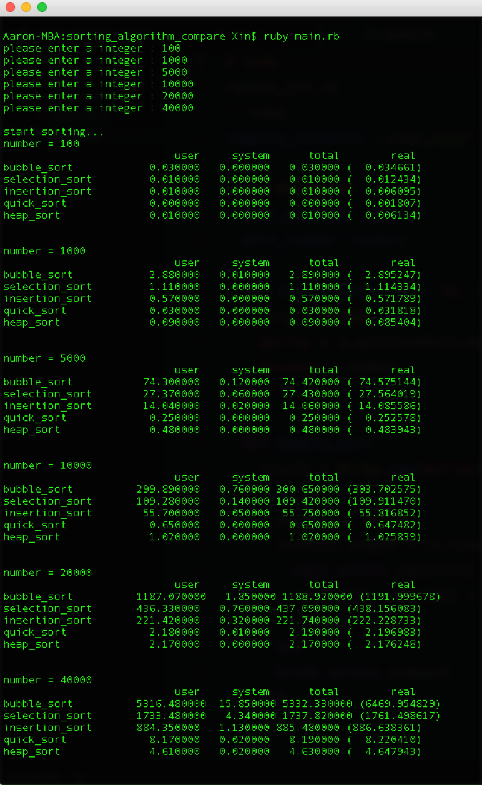
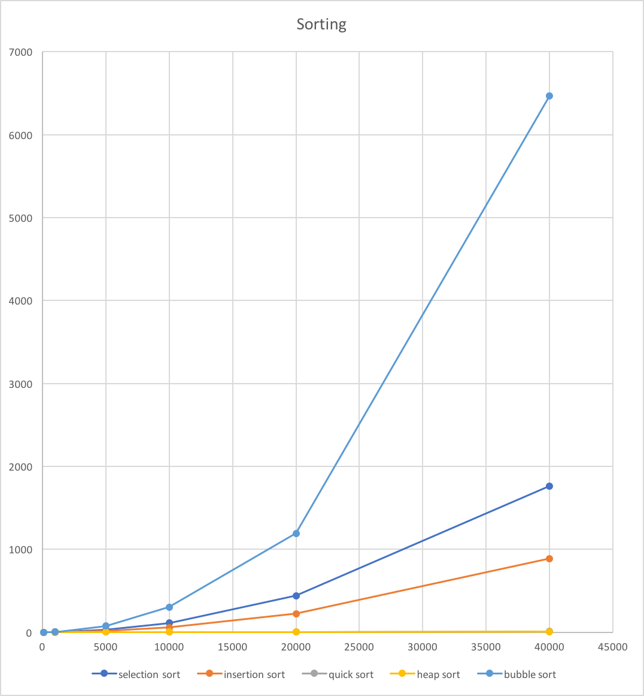

#做法
建立一個新物件RandomInt 內有：
- 建構子 RandomInt.new(number:亂數個數,range:亂數範圍)，產生整數亂數陣列。
- methods :
  - bubble_sort
  - selection_sort
  - insertion_sort
  - quick_sort
  - heap_sort.

建立一個新物件MinHeap內有：
- 建構子MinHeap.new(array)，產生min_heap。
- methods :
  - size
  - add(number)
  - pop
  - empty?

主程式，詢問6次IO輸入建立對應的6個RandomInt物件，其亂數個數為方才輸入的個數。
6個RandomInt物件的每個排序方式各呼叫25次，並將時間記錄下來。

# 結果

# 討論與心得
實作這些排序方法印象很深刻，好的方法處理大一點的數據，可以省下非常多的時間，以後寫程式會特別注意自己寫出來的時間複雜度，精進自己的產品效能。

這次等好久，而且我才輸入到40000個，作業後，讓我萌生想換電腦的念頭。
